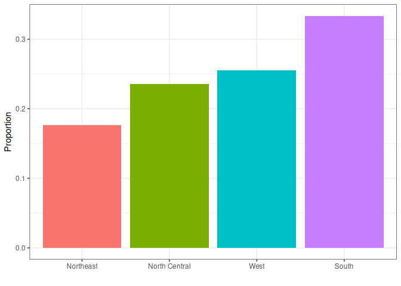
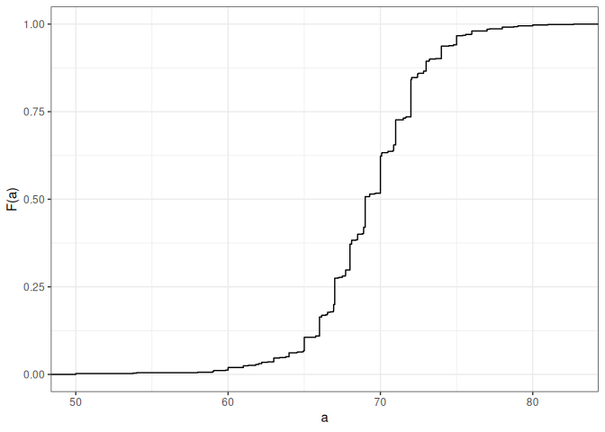
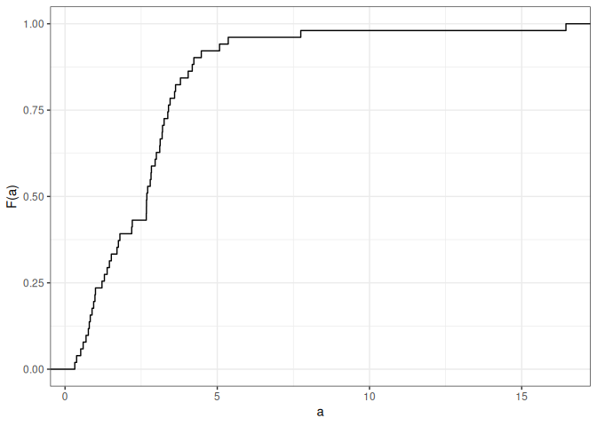
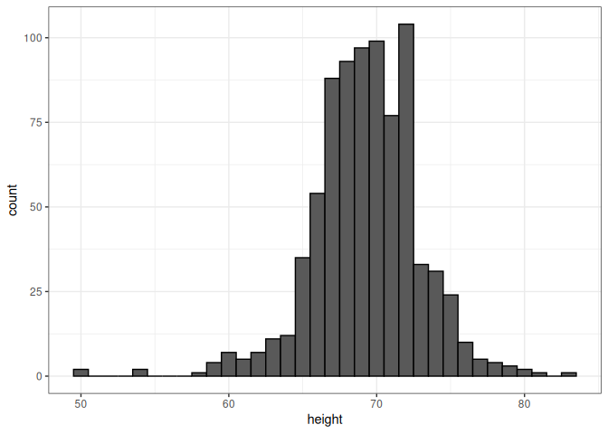
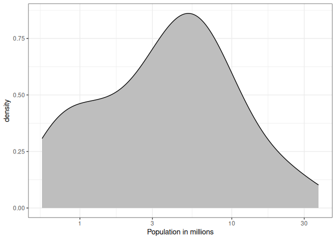
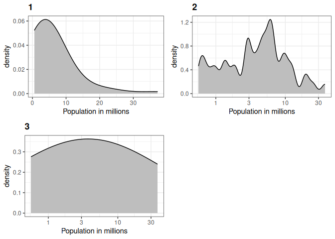

Assessment 1.2.1: Distributions
================

- [Practice Question 1](#practice-question-1)
- [Practice Question 2](#practice-question-2)
- [Practice Question 3](#practice-question-3)
- [Practice Question 4](#practice-question-4)
- [Practice Question 5](#practice-question-5)
- [Practice Question 6](#practice-question-6)
- [Practice Question 7](#practice-question-7)
- [Practice Question 8](#practice-question-8)
- [Practice Question 9](#practice-question-9)
- [Practice Question 10](#practice-question-10)

#### *This assessment contains only Practice Questions.*

### Practice Question 1

You may have noticed that numerical data is often summarized with the
average value. For example, the quality of a high school is sometimes
summarized with one number: the average score on a standardized test.
Occasionally, a second number is reported: the standard deviation. So,
for example, you might read a report stating that scores were 680 plus
or minus 50 (the standard deviation). The report has summarized an
entire vector of scores with with just two numbers. Is this appropriate?
Is there any important piece of information that we are missing by only
looking at this summary rather than the entire list? We are going to
learn when these 2 numbers are enough and when we need more elaborate
summaries and plots to describe the data.

Our first data visualization building block is learning to summarize
lists of factors or numeric vectors. The most basic statistical summary
of a list of objects or numbers is its distribution. Once a vector has
been summarized as distribution, there are several data visualization
techniques to effectively relay this information. In later assessments
we will practice to write code for data visualization. Here we start
with some multiple choice questions to test your understanding of
distributions and related basic plots.

In the murders dataset, the region is a categorical variable. Run the
code in the snippet to see its distribution.

<!-- -->

To the closet 5%, what proportion of the states are in the North Central
region?

- [ ] 75%
- [ ] 50%
- [x] 25%
- [ ] 5%

### Practice Question 2

In the murders dataset, the region is a categorical variable. Run the
code in the snippet to see its distribution.

``` r
library(dplyr)
library(ggplot2)
library(dslabs)
ds_theme_set()
data(murders)
murders %>%
  group_by(region) %>%
  summarize(n = n()) %>%
  mutate(Proportion = n / sum(n),
         region = reorder(region, Proportion)) %>%
  ggplot(aes(x = region, y = Proportion, fill = region)) +
  geom_bar(stat = "identity", show.legend = FALSE) +
  xlab("")
```

<!-- -->

Which of the following is true:

- [ ] The graph is a histogram.
- [x] The graph shows only four numbers with a bar plot.
- [ ] Categories are not numbers so it does not make sense to graph the
  distribution.
- [ ] The colors, not the height of the bars, describe the distribution.

### Practice Question 3

Run the code in the snippet to show the eCDF for male heights:

``` r
library(dplyr)
library(ggplot2)
library(dslabs)
data(heights)
heights %>% filter(sex == "Male") %>% ggplot(aes(height)) +
  stat_ecdf() +
  ylab("F(a)") + xlab("a")
```

<!-- -->

Based on the plot, what percentage of males are shorter than 75 inches?

- [ ] 100%
- [x] 95%
- [ ] 80%
- [ ] 72 inches

### Practice Question 4

Run the code in the snippet to show the eCDF for male heights:

``` r
library(dplyr)
library(ggplot2)
library(dslabs)
data(heights)
heights %>% filter(sex == "Male") %>% ggplot(aes(height)) +
  stat_ecdf() +
  ylab("F(a)") + xlab("a")
```

<!-- -->

To the closest inch, what height m has the property that 1/2 of the male
students are taller than m and 1/2 are shorter?

- [ ] 61 inches
- [ ] 64 inches
- [x] 69 inches
- [ ] 74 inches

### Practice Question 5

Run the code in the snippet to show an eCDF of the murder rates across
states.

``` r
library(dplyr)
library(ggplot2)
library(dslabs)
ds_theme_set()
data(murders)
murders %>%
  mutate(murder_rate = total / population * 10^5) %>%
  ggplot(aes(murder_rate)) +
  stat_ecdf() +
  ylab("F(a)") + xlab("a")
```

<!-- -->

Knowing that there are 51 states (counting DC) and based on this plot,
how many states have murder rates larger than 10 per 100,000 people?

- [x] 1
- [ ] 5
- [ ] 10
- [ ] 50

### Practice Question 6

Run the code in the snippet to show an eCDF of the murder rates across
states:

``` r
library(dplyr)
library(ggplot2)
library(dslabs)
ds_theme_set()
data(murders)
murders %>%
  mutate(murder_rate = total / population * 10^5) %>%
  ggplot(aes(murder_rate)) +
  stat_ecdf() +
  ylab("F(a)") + xlab("a")
```

<!-- -->

Based on the eCDF above, which of the following statements are true:

- [ ] About half the states have murder rates above 7 per 100,000 and
  the other half below.
- [ ] Most states have murder rates below 2 per 100,000.
- [ ] All the states have murder rates above 2 per 100,000.
- [x] With the exception of 4 states, the murder rates are below 5 per
  100,000.

### Practice Question 7

Run the code in the snippet to see a histogram of male heights in our
`heights` dataset:

``` r
library(dplyr)
library(ggplot2)
library(dslabs)
data(heights)
heights %>%
  filter(sex == "Male") %>%
  ggplot(aes(height)) +
  geom_histogram(binwidth = 1, color = "black")
```

<!-- -->

Based on this plot, how many males are between 62.5 and 65.5?

- [ ] 11
- [ ] 29
- [x] 58
- [ ] 99

### Practice Question 8

Run the code in the snippet to see a histogram of male heights in our
`heights` dataset:

``` r
library(dplyr)
library(ggplot2)
library(dslabs)
data(heights)
heights %>%
  filter(sex == "Male") %>%
  ggplot(aes(height)) +
  geom_histogram(binwidth = 1, color = "black")
```

<!-- -->

About what percentage are shorter than 60 inches?

- [x] 1
- [ ] 10
- [ ] 25
- [ ] 50

### Practice Question 9

Run the code in the snippet to see the density plot:

``` r
library(dplyr)
library(ggplot2)
library(dslabs)
data(murders)
murders %>%
  ggplot(aes(x = population / 10^6)) +
  geom_density(fill = "grey") +
  scale_x_log10() +
  xlab("Population in millions")
```

<!-- -->

Based on the plot, about what proportion of US states have populations
larger than 10 million?

- [ ] 0.02
- [x] 0.15
- [ ] 0.5
- [ ] 0.55

### Practice Question 10

Run the code in the snippet to see the density plot:

``` r
library(dplyr)
library(ggplot2)
library(gridExtra)
```

    ## 
    ## Attaching package: 'gridExtra'

    ## The following object is masked from 'package:dplyr':
    ## 
    ##     combine

``` r
library(dslabs)
data(murders)
p1 <- murders %>%
  ggplot(aes(x = population / 10^6)) +
  geom_density(fill = "grey", bw = 5) +
  xlab("Population in millions") +
  ggtitle("1")

p2 <- murders %>%
  ggplot(aes(x = population / 10^6)) +
  geom_density(fill = "grey", bw = .05) +
  scale_x_log10() + xlab("Population in millions") +
  ggtitle("2")

p3 <- murders %>%
  ggplot(aes(x = population / 10^6)) +
  geom_density(fill = "grey", bw = 1) +
  scale_x_log10() +
  xlab("Population in millions") +
  ggtitle("3")

grid.arrange(p1, p2, p3, ncol = 2)
```

<!-- -->
Is it possible that they are from the same dataset? Which of the
following statements is true:

- [ ] It is impossible that they are from the same dataset.
- [ ] They are from the same dataset, but different due to code errors.
- [ ] They are the same dataset, but the first and second undersmooth
  and the third oversmooths.
- [x] They are the same dataset, but the first does not have the x-axis
  in the log scale, the second undersmooths and the third oversmooths.
